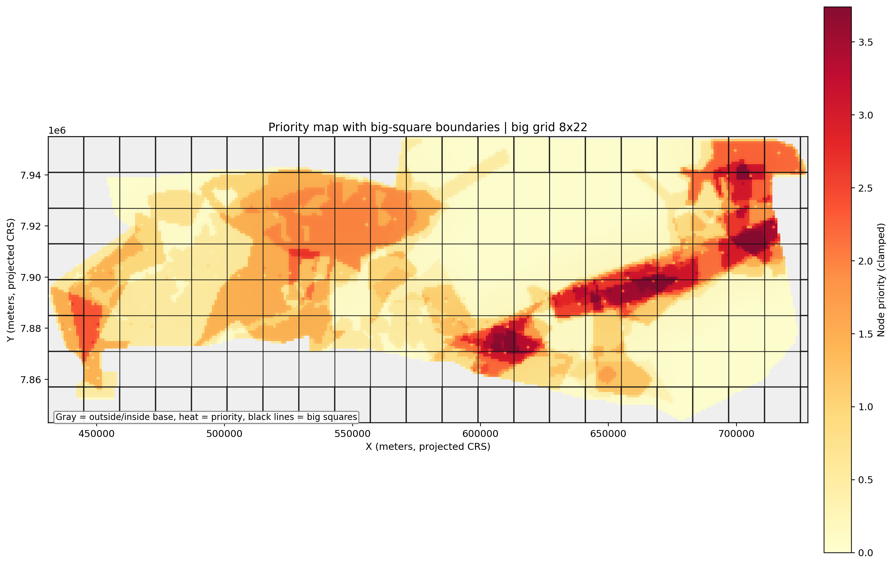
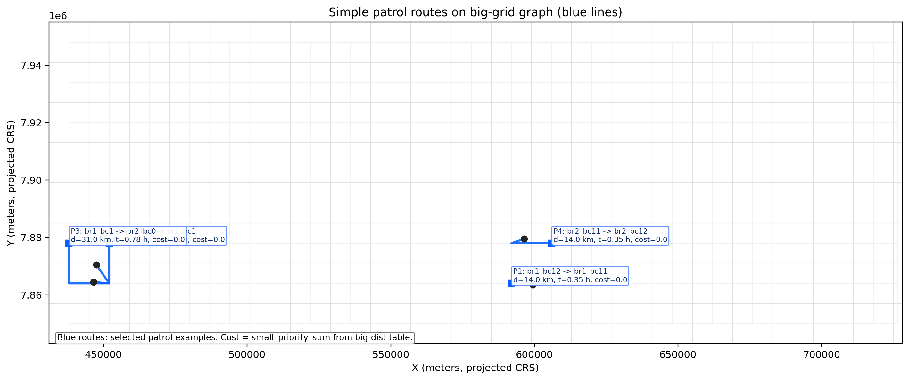
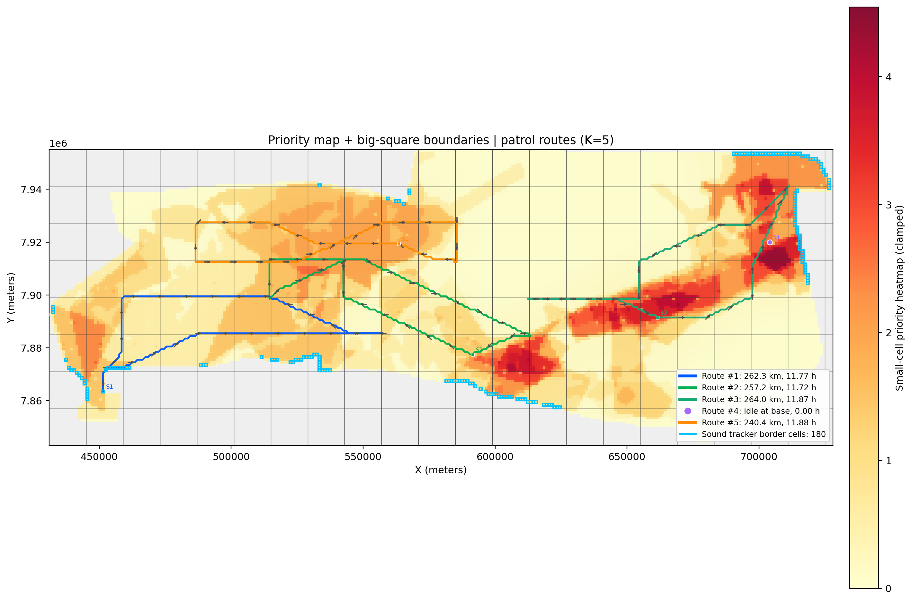

# Etosha Wildlife Protection — IM²C 2026

Code and selected visualizations from our 2026 International Mathematical Modeling Challenge solution to **Protecting Wildlife at Scale**, using Etosha National Park in Namibia as the case study.

Our team received an **IM²C Meritorious Award** at the international level. In 2026, 68 finalist teams from 37 countries and regions reached the international round; 11 teams received Meritorious recognition. Official results: https://immchallenge.org/2026-results/

## Model

We treated park protection as a constrained resource-allocation problem. The computational pipeline combines a spatial graph of the park with threat priorities, patrol routing, monitoring coverage, stochastic risk simulation, and budget search.

The main stages are:

1. **Spatial representation** — convert geospatial layers into a navigable grid/graph and aggregate it into larger blocks for tractable optimization.
2. **Priority scoring** — assign local and neighborhood-aware priority values from wildlife, water, vegetation, and existing coverage features.
3. **Patrol allocation** — distribute ranger groups across patrol houses and candidate areas under travel-time and overlap constraints.
4. **Monitoring allocation** — allocate GPS and acoustic/sound-tracker coverage within the available budget.
5. **Risk simulation** — simulate seasonal threat events and interception under a fixed set of modeling assumptions.
6. **Plan search** — screen many feasible allocations on a shorter horizon, then evaluate the strongest candidates over a full simulated year.

## Code

- `build_graph.py` — geospatial ingestion and fine-grid construction
- `solution/compute_node_priority.py` — spatial priority scoring
- `solution/build_big_square_graphs.py` — block-level graph construction
- `solution/build_big_dist_with_portals.py` — inter-block route and travel-cost preprocessing
- `math_solution/patrol_alloc_greedy_unique.py` — patrol allocation search
- `math_solution/select_sound_border_cells.py` — border monitoring placement
- `math_solution/risk_year_simulation.py` — seasonal annual-risk simulation
- `math_solution/math_model.py` — budget logic and top-level plan search
- `math_solution/viz_patrol_alloc_k2.py` — route/allocation visualization
- `single_patrol_demo.py` — single-patrol routing demonstration

## Selected outputs

### Spatial priority

### Patrol routing

### Example optimized allocation

## Reproduction note

This repository is a curated version of the original working code. Large generated graph matrices, raw geospatial source files, and intermediate artifacts are intentionally excluded from the current tree. The expected data products and filenames are documented in `data/README.md`.

The simulation parameters in `risk_year_simulation.py` are modeling assumptions used for the competition analysis, not field-calibrated conservation forecasts.

## My contribution

I co-developed the mathematical model, developed the optimization/search approach used to compare resource allocations, and implemented the computational pipeline and simulations used to evaluate candidate plans.
